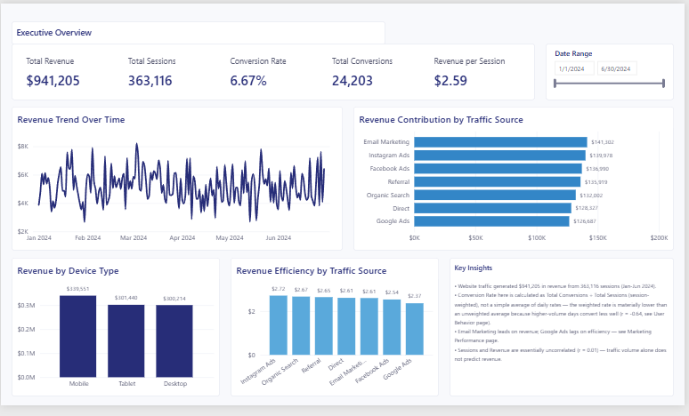
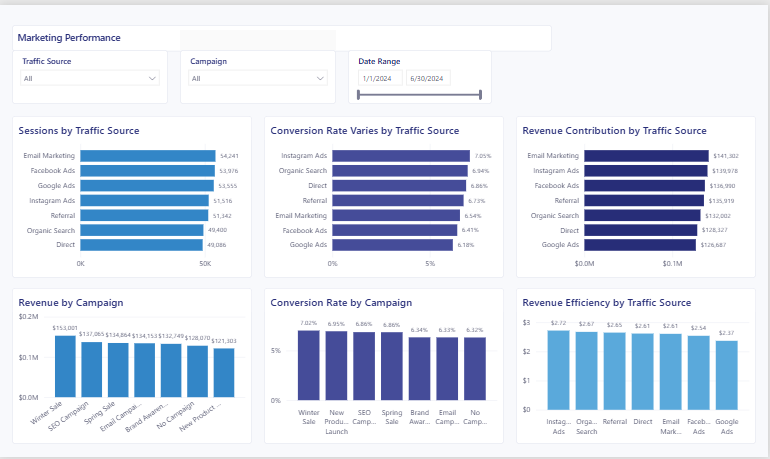

# Website Traffic & Revenue Analysis


A personal data analytics project analyzing website traffic, marketing performance, user behavior, conversions, and revenue for a six-month e-commerce dataset (January–June 2024). The project moves from raw data through cleaning, exploratory and statistical analysis in Python, and into an interactive Power BI dashboard with a modeled semantic layer and DAX measures.

I built this project to practice and demonstrate the full analytics workflow I use as a data analyst: turning a raw dataset into a statistically grounded, stakeholder-ready decision-support tool — not just a set of charts.

**Central finding:** traffic volume and revenue are essentially uncorrelated (r = 0.012) in this dataset. Conversion quality, not session count, is what actually drives revenue — and session volume is *negatively* correlated with conversion rate (r = -0.640), meaning the channels bringing in the most traffic tend to convert it least efficiently.

---

## Table of Contents

- [Project Workflow](#project-workflow)
- [Business Questions Answered](#business-questions-answered)
- [Dataset](#dataset)
- [Data Cleaning](#data-cleaning)
- [Exploratory Data Analysis](#exploratory-data-analysis)
- [Statistical Analysis: Correlation](#statistical-analysis-correlation)
- [Key Business Insights](#key-business-insights)
- [Power BI Dashboard](#power-bi-dashboard)
- [Power BI Data Model](#power-bi-data-model)
- [DAX Measures](#dax-measures)
- [Interactivity](#interactivity)
- [Tools & Technologies](#tools--technologies)
- [Repository Structure](#repository-structure)
- [Limitations](#limitations)
- [Project Outcome](#project-outcome)

---

## Project Workflow

```
Raw Data
   ↓
Data Cleaning
   ↓
Exploratory Data Analysis (Python)
   ↓
Statistical Analysis (Correlation)
   ↓
Business Insights
   ↓
Power BI Data Modeling
   ↓
DAX Measures
   ↓
Interactive Dashboard
   ↓
Stakeholder-Ready Reporting
```

| Stage | What happened |
|---|---|
| **Raw data** | 1,274-row website traffic export loaded into pandas |
| **Data cleaning** | Type conversion, categorical standardization, feature extraction |
| **EDA (Python)** | Traffic source, device, campaign, page, and time-based breakdowns in pandas/seaborn |
| **Statistical analysis** | Pearson correlation across sessions, conversions, conversion rate, revenue, and bounce rate |
| **Business insights** | Translating statistical patterns into channel- and device-level recommendations |
| **Power BI modeling** | A fact table plus a dedicated date table, connected by an explicit relationship |
| **DAX measures** | Explicit, weighted measures replacing raw-column aggregation |
| **Interactive dashboard** | A 3-page Power BI report with slicers and cross-filtering |
| **Stakeholder reporting** | An executive-first layout designed to be read in under a minute |

---

## Business Questions Answered

- How much revenue does the website generate, and from how much traffic?
- Which traffic sources generate the most revenue?
- Which traffic sources convert most efficiently?
- Which campaigns perform best on revenue and on conversion rate?
- How does performance vary by device?
- Does more traffic necessarily translate into more revenue?
- How does traffic volume relate to conversion rate?
- Which months and days perform strongest?
- Are there identifiable seasonal or weekly patterns?
- What should stakeholders prioritize to improve acquisition and conversion performance?

---

## Dataset

**Source file:** [`data/cleaned_website_traffic.csv`](data/cleaned_website_traffic.csv) — the cleaned, analysis-ready dataset used for every result in this README and the dashboard. The original export, [`data/website_traffic_Raw_dataset.csv`](data/website_traffic_Raw_dataset.csv), is kept in the repository for traceability.

- **1,274 rows**, one row per Date × Traffic Source × Device Type × Page combination
- **19 columns**
- **Date range:** January 1, 2024 – June 30, 2024
- **No null values** in any column
- **No duplicate rows**

| Category | Columns |
|---|---|
| Time | `Date`, `Month`, `Day`, `Weekday`, `Year` |
| Acquisition | `Traffic_Source` (7 channels), `Campaign_Name` (7 campaigns, incl. "No Campaign") |
| Context | `Device_Type` (Mobile, Tablet, Desktop), `Country`, `Page_Visited` (6 page types) |
| Traffic volume | `Sessions`, `Users`, `New_Users` |
| Engagement | `Bounce_Rate`, `Avg_Session_Duration` |
| Outcomes | `Conversions`, `Revenue` |
| Derived metrics | `Conversion_Rate` (`Conversions / Sessions`), `Revenue_per_Session` (`Revenue / Sessions`) |

---

## Data Cleaning

Cleaning and preparation were done in the [analysis notebook](notebook/website_traffic_analysis.ipynb.ipynb) with pandas:

- Loaded the raw traffic export and inspected data types and structure
- Converted `Date` to a proper datetime type to enable time-based analysis
- Extracted `Month`, `Day`, and `Weekday` from `Date` as separate time-dimension fields
- Reviewed categorical fields (`Traffic_Source`, `Device_Type`) for inconsistent labeling and standardized formatting — no major discrepancies were found
- Engineered `Conversion_Rate` (`Conversions / Sessions`) and `Revenue_per_Session` (`Revenue / Sessions`) as derived analytical fields
- Verified the cleaned dataset has zero nulls and zero duplicate rows before proceeding to analysis

The result is `cleaned_website_traffic.csv`, the single source of truth for both the Python analysis and the Power BI dashboard.

---

## Exploratory Data Analysis

EDA was performed in Python (pandas, seaborn, matplotlib) before any dashboard work started, so that the dashboard's structure would be driven by what the data actually showed rather than by assumption. The notebook works through:

- **Overview** — total sessions, conversions, and revenue
- **Traffic source analysis** — sessions, revenue, and conversion rate by channel
- **Campaign analysis** — revenue and conversion rate by campaign
- **Device analysis** — sessions, revenue, and conversion rate by device type
- **Page-level analysis** — sessions, revenue, and conversion rate by page type
- **Time-based analysis** — monthly and day-of-week revenue trends
- **Correlation analysis** — Pearson correlation across the key numeric fields

Performing this breakdown first is what surfaced the project's central tension: the channel and device that bring in the *most* traffic (Mobile, Google Ads) are not the ones that convert it *best* (Tablet, Direct/Organic) — a pattern that only becomes visible once traffic is examined alongside conversion rate and revenue together, rather than on its own.

---

## Statistical Analysis: Correlation

Pearson correlation was used to test which numeric relationships in the dataset actually hold up, rather than relying on visual impressions from bar charts alone. Correlation was used to identify relationships in the observed data — not to establish causality.

| Relationship | r | Interpretation |
|---|---:|---|
| Sessions ↔ Revenue | **0.012** | Essentially no linear relationship between session volume and revenue |
| Sessions ↔ Conversion Rate | **-0.640** | A moderately strong negative linear relationship — the dataset shows that as session volume rises, conversion rate tends to fall |
| Conversions ↔ Revenue | 0.84 | Strong positive relationship — revenue tracks conversions, not raw traffic |
| Conversion Rate ↔ Revenue | 0.51 | Moderate positive relationship — conversion quality is a meaningful revenue driver |
| Revenue per Session ↔ Revenue | 0.67 | Strong positive relationship — the best single revenue predictor among the metrics tested |
| Bounce Rate ↔ Revenue | 0.004 | No meaningful relationship |

A correlation of 0.012 indicates essentially no linear relationship between session volume and revenue in this dataset. A correlation of -0.640 indicates a moderately strong negative linear relationship between sessions and conversion rate. The analysis suggests that channels driving disproportionately high session volume (Google Ads, in this dataset) tend to bring in lower-intent traffic that converts less efficiently — not that additional sessions themselves cause conversion rates to drop.

---

## Key Business Insights

**1. Revenue performance.** The website generated **$941,205** in total revenue from **363,116** sessions and **24,203** conversions over the six-month period.

**2. Traffic volume alone is not a revenue strategy.** Traffic volume alone does not explain commercial performance. The analysis compares sessions, conversion rate, and revenue together to identify channels that generate valuable traffic rather than simply high traffic — and the two are not the same channels here.

**3. Traffic-source performance.** Email Marketing generates the most revenue ($141,302 from 54,241 sessions), while Google Ads generates the most sessions (53,555) but converts weakest of all seven channels (6.18%) and returns the lowest revenue per session ($2.37). Instagram Ads converts best (7.05%) and earns the most per session ($2.72).

**4. Device performance.** Mobile drives the most sessions (134,995) and the most revenue ($339,551), but converts weakest of the three device types (6.47%). Tablet, despite the lowest session volume, converts best (6.82%), followed by Desktop (6.74%).

**5. Campaign performance.** Winter Sale is the strongest campaign on revenue ($153,001) and conversion rate (7.02%). New Product Launch converts second-best (6.95%) despite generating the least revenue of any campaign, suggesting a smaller but higher-intent audience. Email Campaign and "No Campaign" (organic/brand traffic) convert weakest (6.33% and 6.32%).

**6. Conversion behavior.** The dataset's overall conversion rate is **6.67%**, calculated as total conversions divided by total sessions. This differs from the simple day-level average of 8.5% because higher-traffic days convert at a lower rate — consistent with the -0.640 correlation above. The weighted figure is the more accurate read of true conversion performance.

**7. Time and seasonality.** March is the strongest month ($173,832), roughly 20% above the weakest month, April ($144,666). Friday is the strongest day of the week ($143,052), followed by Sunday ($141,338); Tuesday is the weakest ($127,007).

**8. Correlation findings.** Sessions and revenue are effectively uncorrelated (r = 0.012), while sessions and conversion rate show a moderate negative relationship (r = -0.640). Revenue tracks conversions (r = 0.84) and revenue-per-session (r = 0.67) far more closely than it tracks raw session count — the clearest quantitative evidence that traffic quality outweighs traffic quantity in this dataset.

---

## Power BI Dashboard

The dashboard is a 3-page Power BI report built on top of the cleaned dataset, with an explicit semantic model and DAX measures (not just charts on raw columns). It's styled with a custom navy-and-blue visual theme for a clean, stakeholder-ready look.

### Page 1 — Executive Overview

The stakeholder-level summary: overall revenue, traffic, conversions, and where revenue is coming from, at a glance.



- KPI row: **Total Revenue ($941,205)**, **Total Sessions (363,116)**, **Conversion Rate (6.67%)**, **Total Conversions (24,203)**, **Revenue per Session ($2.59)**
- Revenue trend over time (daily line chart, Jan–Jun 2024)
- Revenue contribution by traffic source
- Revenue by device type
- Revenue efficiency (revenue per session) by traffic source
- A date-range slicer and a written key-insights callout explaining the conversion-rate methodology and headline findings

### Page 2 — Marketing Performance

Evaluates marketing acquisition performance: which channels and campaigns generate traffic, and which convert it efficiently.



- Sessions by traffic source
- Conversion rate by traffic source
- Revenue contribution by traffic source
- Revenue by campaign
- Conversion rate by campaign
- Revenue efficiency by traffic source
- Slicers for Traffic Source, Campaign, and Date

This page is built to answer: which channels generate traffic, which convert efficiently, which campaigns contribute the most revenue, and where traffic volume and conversion efficiency diverge (Google Ads being the clearest case).

### Page 3 — User Behavior & Time Trends

Analyzes when and on which devices users are most likely to convert, and tests whether traffic volume actually predicts revenue.


- Conversion rate by device type
- Revenue by month
- Revenue by weekday
- Daily sessions trend
- A Sessions-vs-Revenue scatter plot (daily grain)
- Two live correlation cards: **Sessions vs Revenue = 0.012**, **Sessions vs Conversion Rate = -0.640**
- A written findings panel stating the validated correlations and that correlation does not imply causation
- A Device Type slicer

---

## Power BI Data Model

The dashboard was rebuilt from an earlier flat, single-table report into a proper two-table model:

- **FactWebsiteTraffic** — the cleaned dataset, imported via Power Query, with the numeric columns that feed measures (Sessions, Conversions, Revenue, and the two derived rate columns) hidden so the model steers users toward the explicit measures rather than raw-column aggregation
- **DimDate** — a dedicated calendar table (Date, Year, Month, Year-Month, Quarter, Weekday, with proper chronological sort order on the text fields) generated in Power Query and marked as the model's official date table
- A single, active, one-directional relationship: `DimDate[Date] → FactWebsiteTraffic[Date]`
- Auto Date/Time disabled in favor of the explicit `DimDate` table
- Every visible KPI is driven by an explicit DAX measure — none of the dashboard's numbers come from an implicit column aggregation

This is a two-table model (one fact table, one date dimension), not a multi-dimension star schema — there is currently no separate dimension table for traffic source, campaign, device, or country; those remain categorical columns on the fact table.

---

## DAX Measures

| Measure | Purpose |
|---|---|
| `Total Revenue`, `Total Sessions`, `Total Conversions` | Core sums |
| `Conversion Rate` | Total Conversions ÷ Total Sessions — the primary, session-weighted conversion KPI |
| `Average Conversion Rate (Row-Level)` | Simple average of the row-level conversion rate, kept for transparency alongside the weighted figure |
| `Revenue per Session` | Total Revenue ÷ Total Sessions |
| `Average Revenue per Session` | Simple average of the row-level revenue-per-session figure |
| `Average Sessions per Day`, `Average Conversions per Day` | Daily averages using the date table |
| `Previous Period Revenue/Sessions/Conversions` + `... Growth %` | Month-over-month comparisons |
| `Sessions vs Revenue Correlation`, `Sessions vs Conversion Rate Correlation` | Live Pearson correlation, recalculated for the current filter context |

The primary conversion-rate measure is deliberately weighted rather than averaged, to avoid overweighting low-volume, high-rate days:

```dax
Conversion Rate = DIVIDE([Total Conversions], [Total Sessions])
```

The two correlation measures are computed directly in DAX rather than hard-coded, so they recalculate under any slicer selection while still reproducing the validated 0.012 and -0.640 values on the full, unfiltered dataset:

```dax
Sessions vs Revenue Correlation =
VAR _n = COUNTROWS(FactWebsiteTraffic)
VAR _sumX = SUM(FactWebsiteTraffic[Sessions])
VAR _sumY = SUM(FactWebsiteTraffic[Revenue])
VAR _sumXY = SUMX(FactWebsiteTraffic, FactWebsiteTraffic[Sessions] * FactWebsiteTraffic[Revenue])
VAR _sumX2 = SUMX(FactWebsiteTraffic, FactWebsiteTraffic[Sessions] ^ 2)
VAR _sumY2 = SUMX(FactWebsiteTraffic, FactWebsiteTraffic[Revenue] ^ 2)
VAR _numerator = _n * _sumXY - _sumX * _sumY
VAR _denominator = SQRT((_n * _sumX2 - _sumX ^ 2) * (_n * _sumY2 - _sumY ^ 2))
RETURN DIVIDE(_numerator, _denominator)
```

---

## Interactivity

The dashboard is built for stakeholder exploration, not as a static report:

- **Date range slicer** (Executive Overview, Marketing Performance)
- **Traffic Source slicer** (Marketing Performance)
- **Campaign slicer** (Marketing Performance)
- **Device Type slicer** (User Behavior & Time Trends)
- Default cross-filtering is active on every page, so selecting a value in any slicer or visual filters the rest of that page's visuals in real time

---

## Tools & Technologies

| Category | Tools |
|---|---|
| Data analysis | Python, pandas, NumPy |
| Visualization (EDA) | Matplotlib, Seaborn |
| Notebook environment | Jupyter |
| Dashboard | Power BI Desktop |
| Data modeling & measures | Power Query, DAX |
| Version control | Git, GitHub |

---

## Repository Structure

```
website-traffic-analysis/
├── data/
│   ├── cleaned_website_traffic.csv       # Cleaned, analysis-ready dataset
│   └── website_traffic_Raw_dataset.csv   # Original raw export
├── notebook/
│   ├── website_traffic_analysis.ipynb.ipynb   # Cleaning, EDA, and correlation analysis
│   └── Website Traffic Analysis Jupyter notebook.pdf   # Exported notebook for quick viewing
├── visuals/
│   ├── Executive_overview.png
│   ├── Marketing_Performance.png
│   ├── User Behaviour & Time Trends.png
│   └── Website Traffic Revenue Analysis.pbip   # Power BI project file
└── README.md
```

---

## Limitations

- Correlation does not imply causation — the relationships above describe association in this dataset, not proven cause and effect.
- The analysis reflects the available dataset and observation period (January–June 2024); patterns beyond this window are unconfirmed.
- Historical patterns should not automatically be interpreted as predictive of future performance.
- Conversion rate and revenue should be interpreted alongside traffic volume rather than independently — a channel's conversion rate in isolation doesn't indicate its revenue contribution, and vice versa.
- Campaign cost/spend data is not included in the dataset, so return on ad spend (ROAS) cannot be calculated — only revenue and conversion efficiency.
- Attribution is single-touch (one traffic source per session record); a multi-touch attribution model could shift channel credit.

---

## Project Outcome

This personal project demonstrates my ability to carry an analysis end-to-end: cleaning and validating a raw dataset, using statistical correlation rather than visual impression to test which relationships actually hold, translating those findings into channel- and device-level business insights, and building an interactive Power BI dashboard on a proper data model with explicit, weighted DAX measures rather than default aggregations.

It also reflects a deliberate methodological correction I made partway through the project: the original single-table dashboard computed conversion rate as a simple average of daily rates (8.5%). Rebuilding the model with an explicit, session-weighted measure revealed the true rate is 6.67% — a real, documented example of catching and correcting a metric definition rather than accepting the first number a tool produces.

---

*Patience Anono · [github.com/PatienceAnono/website-traffic-analysis](https://github.com/PatienceAnono/website-traffic-analysis)*
